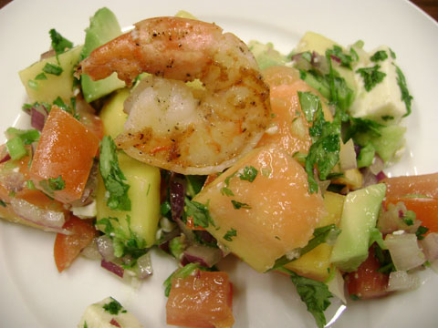
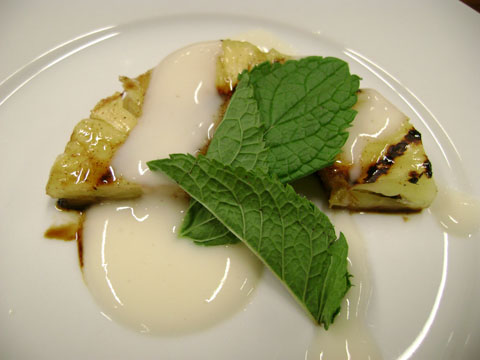

車を持たない＆運転しない我が家では、ダウンタウンにあるLOBLAWSがお気に入り。

たまにCUSTOMER APPRECIATION DAYというのがあって、数々の試食の他、その日はタックスフリーだったり、コーヒー無料でもらえたりする。この前はお花も無料で配っていた。なにより、ここではお客様扱いしてもらえて気分いいのだ。

このカレッジ＆チャーチの<a href="http://www.loblaws.ca/60carlton/">LOBLAWS</a>は、WIFI無料。パスワードもいらないし、I PADでの接続も早い。

ウオークインクリニックもあり、薬局もある。カナダでは、薬を処方してもらうと、薬ひとつにつき薬剤師の手数料がかかる。これが１２ドルくらいかかるのだ。この薬剤師の手数料は、薬代同様OHIPではカバーされない。３種類薬を処方してもらったら、薬代とは別に３６ドルかかるのだ。カナダにきたばかりのころこの金額には本当に驚いた。この手数料は薬局によるのだが、LOBLAWSは8.5ドルだった。

そして、薬が用意されるのを待っている間に買い物したり、インターネットが使えるので処方箋はここでお願いするようになった。

最近料理教室が開催されているのを知り、参加してみることに。

私が参加したのは<a href="http://www.pccookingschool.ca/LCLOnline/cookingSchool.jsp?all=t&amp;tab=cs&amp;storeId=5000008&amp;productId=csaprod8610000&amp;type=details">What's For Dinner</a>という実質無料のクラス。

どういうことかというと、事前にカスタマーサービスで申し込み、１０ドル払い、当日出席するとLOBLAWSの系列店舗で使える１０ドル分のギフトカードがもらえるのだ。

この日は前菜とデザートの２種類。

⬇エビとトロピカルフルーツのサラダ

⬇パイナップルのグリル　シナモン風味のマヌカハニーとヨーグルトのソース

シェフが調理するのをみる形式で、シェフの手元の様子は設置されたモニターに映し出される。ちょっとした切り方のアイデアなど勉強になった。

最後は出来上がった料理を試食して終わり。

参加者は気軽に質問できる雰囲気で、ひとりで参加している男性もいて、積極的に質問していた。

是非また来月参加したい。

 
<a href="http://overseas.blogmura.com/toronto/">にほんブログ村</a>

 
<a href="http://overseas.blogmura.com/canada/">にほんブログ村</a>

