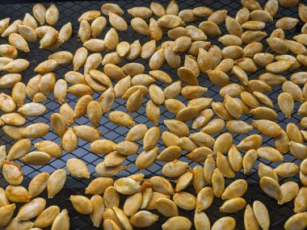

↑　かぼちゃ３個分の種

かぼちゃを料理するときいつも種がもったいないとおもいつつ、どうすることもできず捨てていた。

ある日健康番組をみていたら、かぼちゃの種は食べられて、しかも大変栄養価が優れていることを知った。健康に良いとあれば、一念発起、食べてみようではないか。

タンパク質が豊富なので、カナダではヴィーガンのプロテインパウダーや、ヘルシー志向のサラダのトッピングにも使われていて、わりとポピュラー。

&nbsp;

しかし、手間と時間ばかりかかり非常にめんどくさい。

まず、種にぬるぬるとまとわりつくわたはなかなかおとせない。それなら、とベランダで天日干しを考えたが、リスが出没することもあり、食べられてしまいそうなので無理。そこでオーブンで極低音でローストして乾燥させようとしてみるととなんともいえない生臭いいやな匂いが部屋中を漂った。

その後も殻から種をはがすのが一苦労。キッチンばさみを駆使しても、指が痛くなったり切りすぎて種を切ってしまったり加減が難しい。ぼろぼろとくずれたり、思うようにはきれいにむけない。

&nbsp;

ある日のこと、ふと簡単な方法をおもいついた。

<!--more-->

まずわたのかたまりををざっと落とす。ざっとおとすだけで、薄く種についている程度でおとしきれてなくても全く問題ない。

お皿か網のうえに重ならないように広げ、窓際の風邪通しのよいところにおいておく。最初の1週間は2日おきくらいにざっとかきまわしてカビが生えるのを防ぐ。

電子レンジを使ったりオーブンを使うと電気代がかかるけれど、これだと電気代もかからない。放置するだけ。

２週間くらいしっかり乾かした後は、わたはぱりぱりに乾燥して手で簡単にとれるようになる。

&nbsp;

そして、固い殻向きには爪切りを使う。爪きりのカーブがまたちょうどよく、切りすぎることもなくぴったり。無印で買った爪切りを専用にしてキッチンの引き出しにしまっている。

まず、種の片方の淵をぱちぱちと切る。

あとは、ぱかっとあけるときれいに剥ける。

&nbsp;

そのまま生でも食べられるし、フライパンで軽く炒っても香ばしくおいしい。軽く塩をふってもよい。

ちょっと面倒くさいけれど、動画など見ながらのんびりぽりぽりと食べている。

&nbsp;

ちなみに、かぼちゃの選び方は、下の写真のように、皮がしっかりとした緑で、部分的にみられるオレンジ色が濃いものを選ぶ。これは以前NHKのためしてがってんという番組で紹介されていた方法で、このとおりにすると失敗しない。

&nbsp;
<table style="border-style: none; width: 99px;" border="0" cellspacing="0" cellpadding="0">
<tbody>
<tr style="border-style: none;">
<td style="vertical-align: top; border-style: none; padding: 10px 10px 0pt; width: 44px;"></td>
</tr>
<tr style="border-style: none;">
<td style="font-size: 12px; vertical-align: middle; border-style: none; padding: 10px;">

<a href="https://rpx.a8.net/svt/ejp?a8mat=1U7HZE+3WIBJM+2HOM+BWGDT&amp;rakuten=y&amp;a8ejpredirect=https%3A%2F%2Fhb.afl.rakuten.co.jp%2Fhgc%2Fg00rrau4.2bo11868.g00rrau4.2bo12852%2Fa09082145081_1U7HZE_3WIBJM_2HOM_BWGDT%3Fpc%3Dhttps%253A%252F%252Fitem.rakuten.co.jp%252Fauc-matinoyaoya%252Fkabo0111%252F%26amp%3Bm%3Dhttp%253A%252F%252Fm.rakuten.co.jp%252Fauc-matinoyaoya%252Fi%252F10000188%252F%26amp%3Brafcid%3Dwsc_i_is_33f72da33714639c415e592c9633ecd7" rel="nofollow">楽天　送料無料　北海道産お買得！！訳ありあま〜いかぼちゃ　約10kg（3玉〜13玉）入り</a>

価格:3280円
(2024/11/23 00:51時点)
感想(120件)

</td>
</tr>
</tbody>
</table>
↓使ってます。

<a href="https://rpx.a8.net/svt/ejp?a8mat=1U7HZE+3WIBJM+2HOM+BWGDT&amp;rakuten=y&amp;a8ejpredirect=https%3A%2F%2Fhb.afl.rakuten.co.jp%2Fhgc%2Fg00tpdh4.2bo1196b.g00tpdh4.2bo12d80%2Fa09082145081_1U7HZE_3WIBJM_2HOM_BWGDT%3Fpc%3Dhttps%253A%252F%252Fitem.rakuten.co.jp%252Fmujirushi-ryohin%252F4547315822690%252F%26amp%3Bm%3Dhttp%253A%252F%252Fm.rakuten.co.jp%252Fmujirushi-ryohin%252Fi%252F10003113%252F%26amp%3Brafcid%3Dwsc_i_is_33f72da33714639c415e592c9633ecd7" rel="nofollow">楽天【無印良品 公式】スチール爪切り・大PPカバー付</a>

