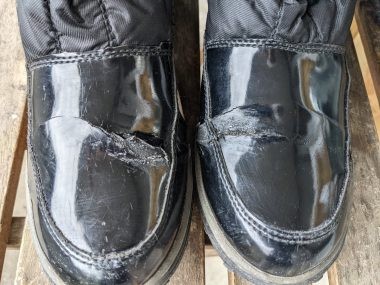
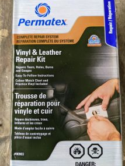
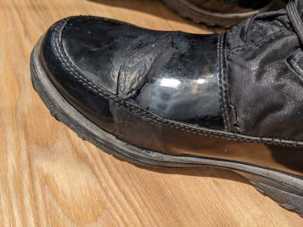
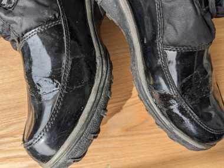

買った方が早いよ。そういわれるたびに違和感を覚えてきた。親切でそう言ってくれたのはわかるけれど、それはもう売っていないもの、買えないものだったからこそ、直らないか、修理できないか、と考えるのだ。

&nbsp;

ひび割れたところからぼろぼろになってしまったブーツをみて、ああ、やってしまった、とおもった。機能的でかつ、デザインも履き心地もよく、お気に入りだった。長持ちさせたければ履いた後、マイナス１０度でも暖かさが保てる極寒地仕様の防水ブーツだったが、この状態では防水機能も保温機能も保たれない。

<!--more-->

長持ちさせたければ履いた後、毎回きちんと手入れしておくべきだったのだ。底の部分もすり減っているわけではないのでまだまだ履けるとおもっていたのに残念。

トロントはの冬は長くて厳しい。寒いだけならまだしも、雪も降って積もる。雪対策に、歩道に大量に塩がまかれる。そのせいで靴がすぐに駄目になってしまうのだ。

&nbsp;

メーカーのオンラインストアをチェックしても、同じデザインのもはもう売っていない。そこで新しいのを探したが、試着してみてもしっくりくるものがみつからない。

&nbsp;

どうせ捨てるなら、その前に、自分で修理してみることにした。

↓修理前。

&nbsp;

↓コレでいけるのではないか、とおもい、アマゾンより安かったので、カナディアンタイアで購入した。

17.49ドル。説明書も同封されているが、メーカーがYou tubeに載せている動画が、分かりやすい。

車の合皮のカーシートなどが補修できる。

↓このキットのみで修復後。

&nbsp;

ブーツの合皮素材の表面がエナメルのようなツヤがある加工だったので、マットな、ゴムっぽい仕上がりがなじんでいない。

そこで、カナダの１００均ショップ、ダラーラマで2.25ドルで買った黒のマニュキアを塗ってみた。

↓マニキュア塗った後

これで、脇の部分はそれほど目立たなくなったが、甲の部分はまだちょっと目立つとはいえ、ずいぶんマシになった。

このブーツが活躍するときは真冬。厳しい寒さでもはやおしゃれどころじゃなく、さらに雪にまみれた足元など誰も気にしないだろう。次に快適なブーツをみつけるまでは十分もってくれそう。

&nbsp;

 
<a href="https://overseas.blogmura.com/toronto/ranking/in?p_cid=10145848" target="_blank" rel="noopener">にほんブログ村</a>

 
<a href="https://overseas.blogmura.com/canada/ranking/in?p_cid=10145848" target="_blank" rel="noopener">にほんブログ村</a>

