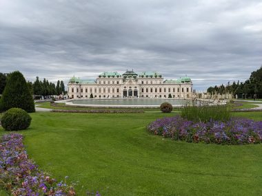
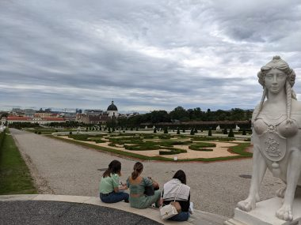
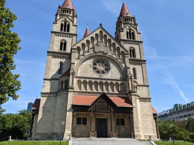
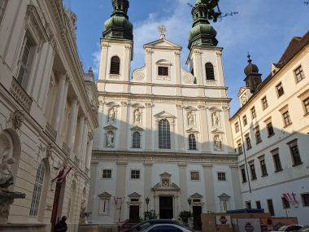
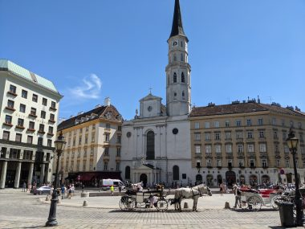
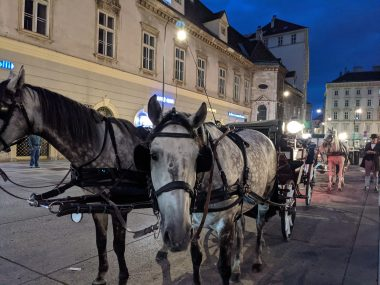

ウイーンでの週末はちょっぴりやっかいだった。

まず、店が閉まる。スーパーが閉まり、食料の確保が難しくなる。滞在しているホテル周辺では当てにしていたお気に入りのレストランも閉まり、どこで食べようかと困った。

観光も、営業時間を事前にチェックして、計画的に行動することが求められる。

仕事のため午後早い時間までという時間が限られている平日と違い、週末は開いていて観光に時間のかかる場所をまわる。

<!--more-->

↓ベルべデーレ宮殿

↓ベルべデーレ宮殿の庭

ドナウ川も見に行った。地下鉄U1で橋のなかほどにあるDonaunissel駅で降りて景色を眺める。これがあの美しき青きドナウという曲で有名なドナウ川か。曲名をきくたびに、遥か彼方の土地に思いを馳せ、いつか行ってみたい、という思いがあったが、願いが叶って感激する。

<video width="1920" height="1080" controls><source src="../uploads/PXL_20210809_102722290.mp4" type="video/mp4"></source></video>

橋から見えた教会にも歩いて見に行ってみた。前まで着いたが中は入れず。

そして、ここは音楽の都でもある。

モーツアルトが暮らした家にも行ってみた。美術館になっていて日本語のオーディオガイドもある。

静かな路地にひっそりとたたずむ。こじんまりとした施設の規模に対してオーディオガイドがやたら長いが、モーツアルトに詳しくなれた。あと、観光客が入ることのない、民家の建物の内部のつくりがわかっておもしろい。

<video width="1920" height="1080" controls><source src="../uploads/PXL_20210808_143117728.mp4" type="video/mp4"></source></video>

&nbsp;

ウイーンでは教会で音楽を聴けるコンサートがあちらこちらで頻繁に開かれている。

イエズス会教会で開かれるパイプオルガンの演奏をきくことにした。

外観とは裏腹に、

&nbsp;

&nbsp;

&nbsp;

&nbsp;

&nbsp;

&nbsp;

&nbsp;

&nbsp;

中は豪華絢爛で、くらくらするほど華美だ。天井のだまし絵が珍しい。

美しい空間にパイプオルガンが大音量で響き渡る。繊細な、心にしみるような曲から、ドラマチックなそれはそれは激しい曲まで圧巻の演奏だった。まさにここでしかできない体験だった。

&nbsp;

<video width="1920" height="1080" controls><source src="../uploads/PXL_20210808_164527219.mp4" type="video/mp4"></source></video>

ウイーンはよくパリと比較されるが、旧市街ではパリの街にはいない馬車が走っている。

乗れる場所は決まっていて、コースがいくつかあるが、それぞれ値段も一律で決まっている。

夜にステファン大聖堂の脇の乗り場から乗った。20分で５５ユーロ。

値段に躊躇したが、おもいきって乗ってみた。歩くよりもぐっと視線が高くなり、夏の夜の風を切って進む馬車は、気持ちいい。アスファルトは快適だが、石畳の道は相当がたがたと体に響いてくるので、昔の貴族も結構大変だったのではなかろうか、などとおもってしまう。これは、昼間に乗ったドナウ川クルーズよりよほど楽しかった。

ドイツ語はちんぷんかんぷんだったが食べるために必死で解読し、ようやくメニューが何となくわかるようになったところで、ウイーンを離れた。

&nbsp;

カナダに帰国して、トロントの図書館でアマデウスというモーツアルトを描いた古い映画のDVDを借りて観て、旅の余韻に浸った。

&nbsp;

ウイーンでのノマドワークの感想。

良かった点。水質が良く、水道水が飲めるのでお腹を壊す心配はいらず、WIFI環境は良好、何より観光は素晴らしい。

良いとは言い難い点。宿泊費、食費は高め、特にコインランドリーが高く、生活費がかさむことと、決してサービスに期待してはいけない。

&nbsp;

 
<a href="https://overseas.blogmura.com/toronto/ranking/in?p_cid=10145848" target="_blank" rel="noopener">にほんブログ村</a>

 
<a href="https://overseas.blogmura.com/canada/ranking/in?p_cid=10145848" target="_blank" rel="noopener">にほんブログ村</a>

&nbsp;

&nbsp;

&nbsp;

&nbsp;

