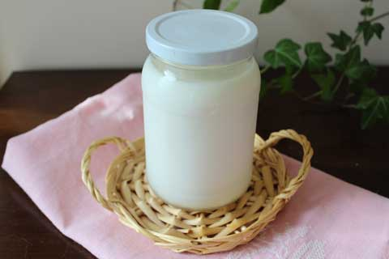

日本から持って帰ってきてよかったもののひとつに、カスピ海ヨーグルトの種菌がある。

ヨーグルトが好きなので毎日食べているが、何故だかわからないが、カナダって、ヨーグルト結構高いのだ。日本より高い気がする。

以前は日本から持ってきたヨーグルトメーカーを使って、市販のヨーグルトを種菌にして作っていて、頻繁につくるのでちょっぴり面倒くさかったのだけれど、カスピ海に切り替えることで解決。なんでもっと早くカスピ海にしなかったなんだろう、と思うくらい大正解。

<!--more-->

カロリーが気にする我が家では牛乳は無脂肪乳を買っているが、市販のヨーグルトを種菌にして作っていたときには、大量のホエーができていた。このホエーはとっておいてパンを作るときに水のかわりに入れていたので、無駄になることはなかったとはいえ、カスピ海では無脂肪乳で作ってもホエーがほとんどでずにきちんと固まるのだ。しかも、酸味が少なく、おいしい。添える甘味の量も減らせる。

そして、ヨーグルトメーカーがいらず、常温で放っておくだけでできるので、より手間がかからない。電気代もいらないのでエコだし経済的。

ヨーグルトを種菌にして作っていたときはせいぜい３回までで、４回目以降は新しいヨーグルトを買ってきて新たな種菌にする必要があったが、それも必要なくなって、最初に種菌を買ってからは頻繁に種菌を買う必要がないのも楽でよい。

↓これを買っています↓ 

 

 

 

<a href="https://rpx.a8.net/svt/ejp?a8mat=1U7HZE+3WIBJM+2HOM+BWGDT&amp;rakuten=y&amp;a8ejpredirect=https%3A%2F%2Fhb.afl.rakuten.co.jp%2Fhgc%2Fg00pybx4.2bo1196b.g00pybx4.2bo129bf%2Fa09082145081_1U7HZE_3WIBJM_2HOM_BWGDT%3Fpc%3Dhttps%253A%252F%252Fitem.rakuten.co.jp%252Fcaspia%252F973481%252F%26m%3Dhttp%253A%252F%252Fm.rakuten.co.jp%252Fcaspia%252Fi%252F10000039%252F" rel="nofollow">フジッコカスピ海ヨーグルト手づくり用種菌セット牛乳を加えるだけでご家庭で簡単にヨーグルトが手作りできる種菌セット 毎日の腸活に！☆グルメ大賞3年連続受賞☆</a>
 

価格:822円 
(2022/3/31 00:57時点) 
感想(11519件)

 

 

 

 
<a href="http://overseas.blogmura.com/toronto/">にほんブログ村</a>

 
<a href="http://overseas.blogmura.com/canada/">にほんブログ村</a>

