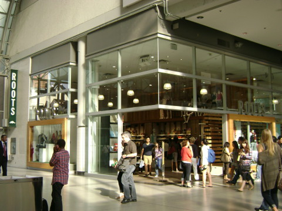

↑　イートンセンター内の店。子供服も売っている。

カナダではスエット（トレーナーのパンツ）の行動範囲が広い。日本では部屋着やジョギングをするときとか、せいぜい自宅からすぐ先の自動販売機かごみを出しにいくくらいだった。

ところがカナダでは、スエットで通学している中高生をよくみかけるし、そこらへんをうろうろしたりするのはもちろん、地下鉄に乗って買い物に行けたりする。はじめは馴染めなかったが、今ではエコノミー症候群の防止にもよかろうと、上下スエット姿で日本行きの飛行機にも乗ってしまっている自分がいる。

ROOTSはカナダのカジュアルブランドで、日本へはまだ進出していないらしい。スエットパンツやジーンズなどの大人の休日着をメインに、子供、ペットの服まで取り扱っていて、私も家ではもっぱらROOTSのスエットパンツを愛用しているが、我が家ではオンラインショッピングを利用して購入することが多い。

ちなみに日本では中肉中背だがカナダでは小柄な私の場合、スエットパンツは大人用ではなく子供服の一番大きいサイズがぴったり。

私は身長１５８センチだが、Girlsの１２を買うと、丈の長さがちょうどよくわざわざ丈つめする必要がないのだ。こちらで普通に大人用のスエットパンツを買うと、丈が長すぎる場合がある。

あとは帽子などの小物類もよく買う。これは大人用だけれど。

ROOTSはメーリングリストに参加すると期間限定のセールや送料無料などのお知らせが頻繁にくる。

たいていそういうときを利用して買っているが、ROOTSは不良品はもちろんサイズが合わなかったとか、好みのものでなかったというだけでレシートを街中の店舗に持っていけば簡単に返品ができるので安心して買い物ができる。

そして、今のところ１００ドル以上で送料は無料のようである。

さらに、我が家ではAirmilesをためているいるが、Airmiles.caから入ってROOTSで買い物をすると、エアマイルもためることができる。

ちなみに今週末まで、セール品も含めすべてのものが２５％OFFになる特別期間中のようだ。

＊２０１２年１０月追記；日本からも買えます（一回のオーダーにつき１５点まで＆食べ物と香水は除く＆関税は自己負担）。その場合送料は一律３５ドル。

もっとトロントを詳しく知りたい方は↓へ

<a href="http://overseas.blogmura.com/toronto/">にほんブログ村</a>

もっとカナダを詳しく知りたい方は↓へ

<a href="http://overseas.blogmura.com/canada/">にほんブログ村</a>
