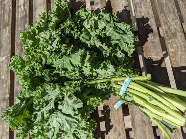
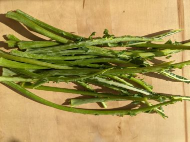
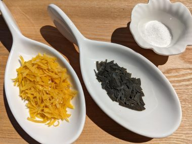
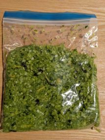
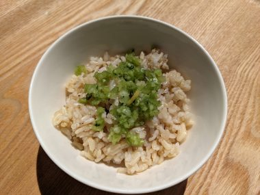

↑一束５８０ｇで２．５ドル

ケールは、トロントではほぼどこのスーパーでも必ずといっていいほどおいていて、しかも一年中手に入れることができる。

その葉は、スムージーにしたり、ケールチップにしたりおいしく食べられる。

そして、大量の茎が残る。

<!--more-->

&nbsp;

さて、この余った茎をどうするか。茎の栄養価も高く、捨てるにはもったいない。

&nbsp;

スープにいれてもいいが、みじんぎりにしたものを浅漬けにしてごはんにふりかけのようにして食べるとおいしく食べられる。

まずフードプロセッサーでみじん切りにする。ジップロックに入れ、計量し、３％の塩と細かくした乾燥昆布やレモンの皮を加えて、袋にいれた状態でよくもみ、一晩おくだけ。

塩の量は、茎が３００グラムだったら、

３００x ０．０３=９

塩9グラムになる。

&nbsp;

フードプロセッサーを使ってあっという間にみじん切りができて、簡単ですぐでき、しかもおいしいので、茎はいつもこれになる。

炒ったゴマやジャコなどをかけてもおいしい。

&nbsp;

&nbsp;

&nbsp;

<a href="https://overseas.blogmura.com/toronto/ranking/in?p_cid=10145848" target="_blank" rel="noopener">にほんブログ村</a>

<a href="https://overseas.blogmura.com/canada/ranking/in?p_cid=10145848" target="_blank" rel="noopener">にほんブログ村</a>

&nbsp;
