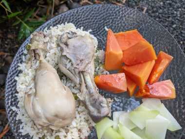
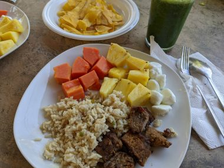
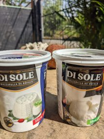
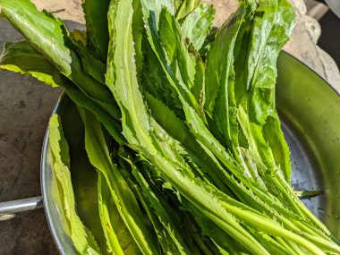
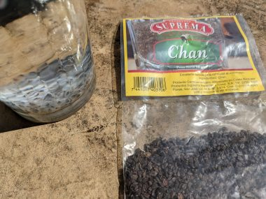
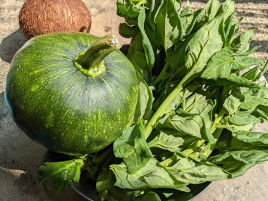
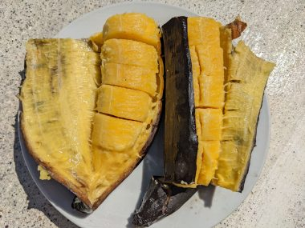

<a href="コスタリカの海辺の田舎まちでワーケーション兼-2.html" target="_blank" rel="noopener">前回の記事</a>

コスタリカ生活で気になった点といえば、物価の高さ。今回滞在した太平洋側はカリブ海側と比べて物価が高めらしいが、平均年収は１２０万円とカナダや日本よりずっと低いのに、カナダや日本とさほど変わらない印象。

キウイはカナダでは一個80セントくらいで買えるが、コスタリカでは795コロン（約１４０円）もした。カナダでは1ドルくらいで買えるがきゅうりが1個2000コロン（約３５０円）もした。その他セロリも2度と買わなかった。

それでも、コスタリカの気候に適した、固有種や大量栽培しやすいものは比較的安いので、そういったものを中心に選んで自炊していた。

<!--more-->

↓米の上に鶏肉をのせ炊飯器で炊いたもの。はやと瓜の塩だけの浅漬けとパパイヤ。パパイヤは必ずといっていいほどどこでも売っている。

玄米１ｋｇ　１１７５コロン（約２１０円）

鶏モモ肉1.7ｋｇ　２３３２コロン　（約４２０円）

パパイヤ　1個（１．８ｋｇ）　１２００コロン　（約２１７円）

&nbsp;

↓豚肉をグリルしたものと炊き込みご飯、パパイヤとパイナップル、水牛のモッツアレラチーズ、グリーンスムージー。

水牛のチーズはコスタリカ産。4075コロン（約730円）、パパイヤと食べると感動のおいしさにはまった。

グリーンスムージーは、コスタリカの固有種の野菜であるCulantro Coyoteという野菜で作った。一束で175コロン（約30円）。どこのスーパーでも売っている。パクチーと似たような風味がある。根本の茎の部分はみじん切りにして玄米と炊きあわせ、葉のほうをスムージーに。

パイナップルの芯の部分は捨てずに、薄く繊維を断ち切るようにスライスしたものを凍らせてからスムージーに加えると、適度な酸味と甘みが加わるうえ、不溶性食物繊維もたっぷりとれる。パイナップルは主要輸出品目であるだけに、パパイヤと同様どこの店にもおいてある。大き目なのが一個１５００コロン（約268円）で買える。

↓Chan seeds　チャンシード、1袋６０ｇで750コロン（約134円）

チャンシードは15分くらい水に浸けてから、チアシードやバジルシードと同じように使うことができる。味はなく、スムージーに加えると栄養価も高くなり、とろみがついて飲みやすくなる。

↓ツルナ、一束475コロン（約85円）とAyote Tiernoという、水っぽいかぼちゃのような、ズッキーニのような野菜、1個725コロン（約130円）

↓皮つきのままBBQグリルで丸焼きにしただけのプランテーンバナナ。

スイカもよく食べた。こぶりなスイカ1.6kgで780コロン（約140円）。白いところも栄養価が高いので、パイナップルの芯と同様捨てずに細かく切って凍らせてスムージーに入れた。

<a href="コスタリカの海辺の田舎まちでワーケーション兼-4.html" target="_blank" rel="noopener">続く</a>

&nbsp;

<a href="https://overseas.blogmura.com/toronto/ranking/in?p_cid=10145848" target="_blank" rel="noopener">にほんブログ村</a>

<a href="https://overseas.blogmura.com/canada/ranking/in?p_cid=10145848" target="_blank" rel="noopener">にほんブログ村</a>
