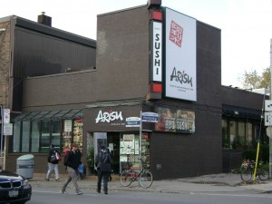

<a href="http://www.groupon.com//raf/UserReferral_rp/121015/10r1act/lk/uu12511060">GROUPON</a>の他に我が家で利用しているグループクーポン購入サイトはいくつかあって、<a href="http://www.wagjag.com/?wid=54c3d58c5efcf59ddeb7486b7061ea5a">WAGJAG</a>や<a href="http://www.buytopia.ca/?ref=Fz689">BUYTOPIA</a>もよく利用している。

ダウンタウンのコリアンタウンにある焼肉が食べられる店、<a href="http://www.arisu.ca/">ARISU</a>には<a href="http://www.buytopia.ca/?ref=Fz689">BUYTOPIA</a>でクーポンを購入して行った。

初めて行った店で、がっかりすることってあるものだ。

そこで我が家では、まだ行ったことがなくて、行ってみたい、または気になっていた店、などは、これらの共同購入サイトをとおしてクーポンを利用して行ってみることが多い。半額くらいの値段で飲み食いできるのはとても魅力的なので、よく利用している。

たとえがっかりしても、ま、この値段ならいいか、と思えるのだ。なかにはたとえクーポンを購入しても二度と行かないだろうと思う店もあったが。

我が家ではもっぱら外食に関して利用しているが、とてもお得な反面、エステや脱毛などの場合特に忙しいひとの場合、なかなか自分の都合の良いときに予約がとれなくて期限切れを迎えてしまうこともあるということも聞いたことがあるので注意が必要だ。

焼き肉といえば、日本に帰ったときも<a href="http://www.groupon.jp/?icf=97j8-c8f">日本のGROUPON</a>でクーポンを購入して、新大久保のコリアンタウンにある焼肉店に行ったことがある。おいしい焼き肉がお得な値段で食べられて大正解だった。これはぜひまた帰国間近になったら利用したい。同じく<a href="http://www.groupon.jp/?icf=97j8-c8f">日本のGROUPON</a>で肉屋のチェーン店が経営している焼き肉食べ放題も購入したのだが、こちらは後悔することになった。

さて、<a href="http://www.arisu.ca/">ARISU</a>では、Arisu Beef Short Ribs Galbi $27.99 と、Negi Beef Tongue $18.99をオーダーした。

骨付きのカルビは、一枚で長く連なっていて、はさみで切って食べる。たれでマリネされてないので、大豆を控えている私は塩とレモン、にんにくのすりおろしとごま油でいただく。

牛タンもおいしかった。

ナムルやキムチなどのサイドディッシュもたっぷり食べて、ふたりともおなかいっぱい。

ここは私たちには予算が高めの店なので、共同購入でクーポンを買う機会があったらぜひまた利用したい。

<a href="http://overseas.blogmura.com/toronto/">にほんブログ村</a>

<a href="http://overseas.blogmura.com/canada/">にほんブログ村</a>
