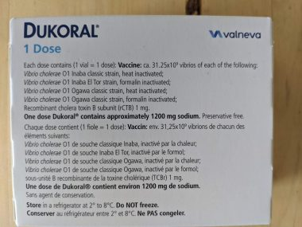
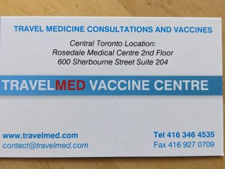
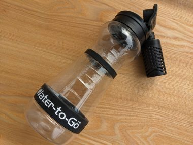

&nbsp;

ブラジル、サンパウロ旅行で治安の他に不安だったのは水。

暑くて水道水の飲めない国に行くと、ほぼ必ず下痢をしてしまう。国によるが、それはそれはひどい下痢に悩まされることもあり、そうするともう観光どころではなくなってしまい、せっかくの旅行がだいなしになってしまう。

過去一番ひどかったのは、エルサルバドル。次にインド。そして、メキシコ、タイと続く。

そんな悩みが解消される画期的なワクチンをみつけた。

それは、<a href="https://dukoralcanada.com/traveller/" target="_blank" rel="noopener">Dukoral</a> という、旅行者下痢対策に有効とされる経口摂取のワクチン。

<!--more-->

数週間前から飲み始めるワクチンで、大腸菌（E.coli)とコレラ(cholera)の感染による旅行者下痢の症状をおさえる効果が期待できる。初めて飲むときは２回の摂取が必要。次の旅行からは１回だけでよくなる。飲んだ後は少しお腹がいたくなる。

&nbsp;

事前情報ではサンパウロは水道水は飲んでも問題ないということになっている。エルサルバドルやインドでは、歯磨きの水は部屋に備え付けの湯沸かし器でいったん沸かしたものを使っていたが、そこまでしなくても大丈夫そうだ。それでも、念のために、飲んでおくことにした。

&nbsp;

&nbsp;

↓ここのクリニックで処方してもらった。

DUKORALは処方箋なしでも買える薬で、ドラッグストアで薬剤師にほしい旨を伝えると、在庫があれば奥から出してきてくれてその場で買える。この場合全額自費になるが、トラベルクリニックへ行って処方箋を書いてもらい、会社のベネフィットの保険会社に申請すると保険が全額おりる。

ただし、トラベルクリニックで支払った診察料は保険はおりない。

このクリニックは平日の昼間予約すると診察料が安くなり、２５ドルですむので、その時間にあわせて予約した。DUKORALはここのクリニックで購入できて、一回分ひと箱７０ドル。全額保険でおりた。

この日は過去の予防接種履歴からA型肝炎の２回目の予防接種もしてもらった。１００ドル。これも保険でおりた。

サンパウロでは、海や川に入ったりするわけでもなく、都心部で数日間過ごすだけなのに７０ドルを払うというのは少々高い気がして、本音を言えば迷っていたが、結果、お腹の調子が悪くなることもなかったので、飲んでおいてよかった。

&nbsp;

そして、水問題解消のための必需品といえば、これ。

川の水でも浄水できるという最強の浄水ボトル。

この浄水ボトルがあれば、お手洗いで手を洗う蛇口の水でも問題なく飲める。

わざわざ水を買うためだけに、店を探して街を彷徨う必要がない。そして、水を買うための小銭も必要なくなるので、現金を使う場面がぐっと減り、両替する回数も減った。 
<table style="border: 1px solid #ccc; width: 90px;" border="0" cellspacing="0" cellpadding="0"> 
<tbody> 
<tr style="border-style: none;"> 
<td style="vertical-align: top; border-style: none; padding: 10px 10px 0pt; width: 60px;"></td> 
</tr> 
<tr style="border-style: none;"> 
<td style="font-size: 12px; vertical-align: middle; border-style: none; padding: 10px;"> 

<a href="https://px.a8.net/svt/ejp?a8mat=1NWF49+F9J44Y+249K+BWGDT&amp;a8ejpredirect=https%3A%2F%2Fwww.amazon.co.jp%2Fdp%2FB00L5GVSVI%2F%3Ftag%3Da8-affi-140598-22" rel="nofollow">amazon Water to-Go 75cl/26オンス 浄水器フィルターボトル</a>
 

 
</td> 
</tr> 
</tbody> 
</table> 

ブラジルは日本と違い電圧は２２０ｖ。ホテルの電源は、カナダや日本と違うタイプ。

↓このマルチプラグを持っていったのがとても助かった。 
<table style="border: 1px solid #ccc; width: 90px;" border="0" cellspacing="0" cellpadding="0"> 
<tbody> 
<tr style="border-style: none;"> 
<td style="vertical-align: top; border-style: none; padding: 10px 10px 0pt; width: 60px;"></td> 
</tr> 
<tr style="border-style: none;"> 
<td style="font-size: 12px; vertical-align: middle; border-style: none; padding: 10px;"> 

<a href="https://px.a8.net/svt/ejp?a8mat=1NWF49+F9J44Y+249K+BWGDT&amp;a8ejpredirect=https%3A%2F%2Fwww.amazon.co.jp%2Fdp%2FB08574ZQT5%2F%3Ftag%3Da8-affi-140598-22" rel="nofollow">アマゾン　iHouse all 海外変換プラグ コンセ ント変換プラグ マルチ変換プラグ 2U SBポート 全世界対 応 経済産業省承認 正規保証1年</a>
 
</td> 
</tr> 
</tbody> 
</table> 
 
<a href="https://px.a8.net/svt/ejp?a8mat=3Z74JE+93GFHU+2JMM+1TJE9T" rel="nofollow"> 
</a> 

<a href="https://px.a8.net/svt/ejp?a8mat=3Z74JE+93GFHU+2JMM+1THW9E" rel="nofollow">180以上の国と地域で使える【World eSIM】</a> 

&nbsp;

