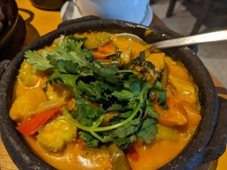
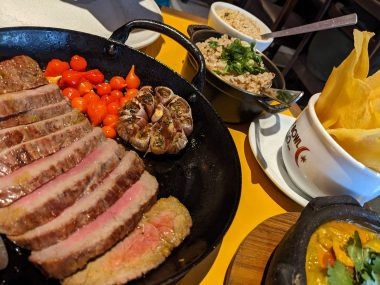
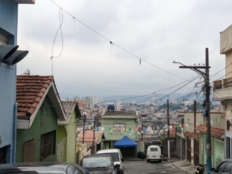
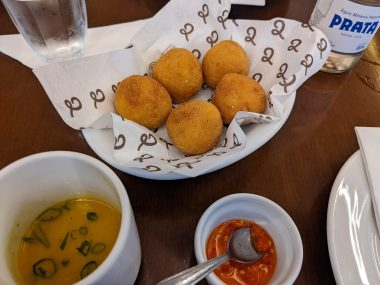
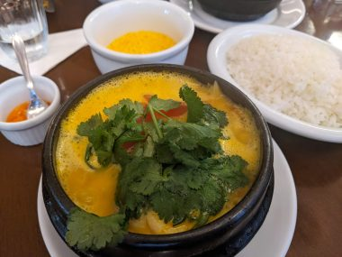
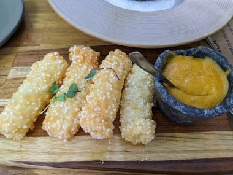
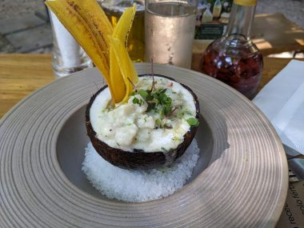
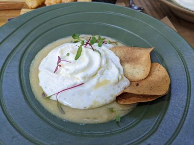
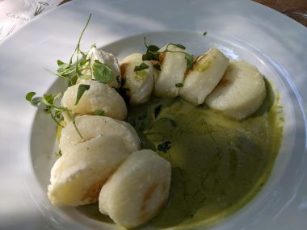

<a href="ブラジル-おいしいサンパウロ-お値打ちミシュ.html" target="_blank" rel="noopener">前回</a>

ーMocotó

サンパウロの月曜は観光客にとって予定を組むのが難しい日だ。大多数の美術館やレストランが閉まってしまう。そんななかこの店は月曜にもオープンしているので、市内からは離れているがUBERを手配して行った。途中渋滞に巻き込まれ、オンラインで予約した１２時より１０分ほど遅れてしまったが、予約の有無を聞かれず席に通された。地元のひとに愛される、カジュアルなレストランといったふうだった。なかなか辺鄙なところにあるのに、結構ひとが入っている。

料理はすべてミシュランガイドでおすすめしてた料理をチョイスしたおかげではずれなしで楽しめた。時間をかけて行った甲斐があった。

<!--more-->

&nbsp;

↑TAPIOCA DICES 26.90レアル（６個）

タピオカの揚げ物。甘めのたれをつけて食べる。

↑MOQUECA SERTANEJA 94.90レアル

モケアカは伝統的なブラジル料理。通常は魚やエビが入っているが、これはベジタリアン版で、プランテーンバナナやカボチャがごろごろ入っている。

↑CARNE-DE-SOL NA BRASA 99.90レアル

グリルしたステーキと丸ごとにんにく、赤いのはピクルス。炊き込みご飯のライスとタピオカチップスの揚げ物が添えられ、かなりのボリューム。

とても食べきれないだろうから、メインはモケアカかステーキかどちらかひとつにしてシェアしたほうが良いと親切なウエイターに説得されたが、ぜひとも両方食べてみたかったので、ライスには手をつけず持ち帰ることにして両方オーダーした。テイクアウトにも快く応じてくれた。

またもやおなか一杯食べて、この日の夕食は買ってあった果物とこの持ち帰ったライスを食べるだけで済んだ。

店を出た後はせっかく遠くまできたこともあり、腹ごなしにぶらぶらと通りを歩いてみた。観光客はいない。地元の生活感を垣間見られる。小高い山の頂上付近に位置するので眺めがいいこと。

&nbsp;

&nbsp;

ーJiquitaia

火曜の昼一時すぎに予約なしでいったら満席で２０分待った。一軒家のレストラン。なかはあまり広くないのかと思ったら、そうではなく長屋のように奥に広がっている作りで、結構な席数はあった。人気の店なのも納得の味だった。ここでもミシュランおすすめの料理を選んだ。この方法だとはずれがないのと、あれこれ迷わなくていいのが気に入った。

&nbsp;

↑coxinhas de frango caipira 38レアル

前菜には鶏肉のコロッケ。写真左下はお通しとしてサービスしてくれたスープ。

↑moqueca　120レアル

モケアカ。エビと魚のモケアカ。テーブルに置かれたときはぐつぐつと煮立っていた。その状態でコーンミールを入れてまぜ、しばらくおくとコーンミールがとけてさらっとしていたスープがとろっととろみがつく。

人気の店なのも納得の味とサービス。

&nbsp;

ーSANTO GRASS (Brig. Faria Lima Avenue, 2705, Sao Paulo, 01451-000)

Museu Da Casa Brasileira という美術館の中の中庭にあるレストラン。

緑にあふれ、開放感いっぱいのなかで繊細でおいしいブラジル料理が堪能できる。

↓ Tapioca churros with seafood vatapa　４５レアル。

タピオカのもちもちとしたフライ。

↓Fish ceviche with coconut　６８レアル。

ココナッツミルクのベースのセビーチェ。生の魚がゴロゴロ入っている。冷製スープ仕立てに近い。

&nbsp;

↓Green corn soup with tulha cheese foam and lemon cracker　６４レアル

&nbsp;

コーンスープの上にムースのようにふわっとした地元のチーズの組み合わせ。カリっとしたクラッカーが添えられている。

↓Tapioca raviloli with cheese and herb sauce　７９レアル。

チーズの入ったタピオカのラビオリとハーブのソース。

木漏れ日を受け、そよぐ風を感じながらおいしいものを食べ、まさに至福の時が過ぎていった。

&nbsp;

<a href="サンパウロ観光-都会でアマゾンのジャングル体.html" target="_blank" rel="noopener">続き：サンパウロ観光～都会でアマゾンのジャングル体験～</a>

<a href="https://px.a8.net/svt/ejp?a8mat=3Z74JE+93GFHU+2JMM+1THW9E" rel="nofollow">180以上の国と地域で使える【World eSIM】</a>

