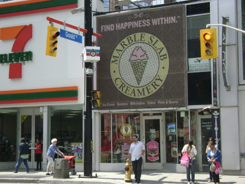
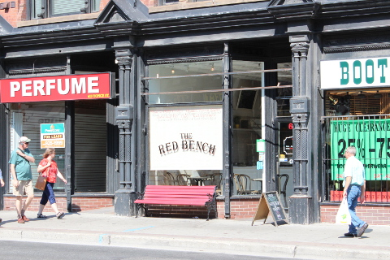
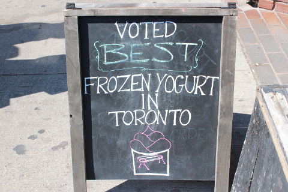
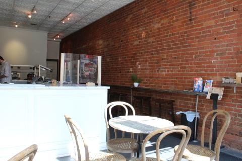
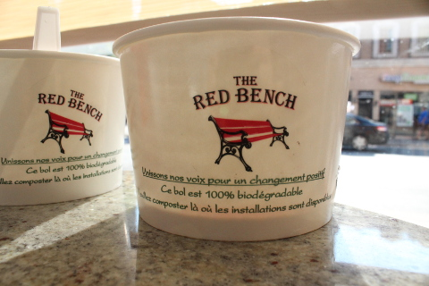

それはダウンタウンにあるアイスクリーム屋MARBLE SLAB CREAMERYに行ったときのこと。

今日は何にしようかと選びながら列に並んで順番待ちをしていた。

<!--more-->

その時ふと、そんなに長い列ではないというのに、列に割り込もうとでもしているのか、私の後ろにいた男性と私との距離がとても近いのを感じた。

私はインドにいたとこのことを思い出した。インドで列に並ぶときは体温が伝わってくるくらい、後ろに並んでいるひとが満員電車並みにぴたっと密着してくる。１０センチでも前のひとと隙間を作れば、割り込まれてしまうのだ。

Ｊ次郎が不自然に私の名前を呼んだ。

Ｊ次郎によると、その男は私のバックパックの外ポケットを開けていたそう。

みると、私のバックパックの外ポケットは見事に全開だった。こんなこともあろうかと、バックパックの外ポケットにはお財布などの大切なものは絶対にいれないようにしている。もちろん何も盗られてなかった。

その後その男はものすごーく不自然につま先だちをして背伸びしながらガラスケースのなかに並んだアイスを選んでいるふりをし、結局何も買わずに店をでていっ た。小柄でこざっぱりとした服装をした、アラサーくらいの一見普通のひと。スリなどするような悪いひとにはみえなかった。スリって、こうして街に溶け込んでいて、だからスリの被害にあうひとが後をたたないんだろうな。

なるほど、確かにアイスを選んでいるときって、注意力散漫になりがち。これからも気をつけなければ、という教訓になった。

そんなことを思い出しながら着いたのは、The Red Benchというオーガニックのフローズンヨーグルトの店。店の名前にもなっている赤いベンチが目印。

カナダ産のオーガニックミルクから作られたフローズンヨーグルトは２０１３年のベストフローズンヨーグルトに選ばれたそう。

白を基調にした店内は明るくて清潔感溢れ、おしゃれで雰囲気も良く居心地が良い。

ここではセルフサービス。

まずカップに自分でフローズンヨーグルトを好きな量盛り、トッピングも好きなのを好きなだけ自分で振り掛ける。

お支払いは計量して、重さによって決まる仕組み。

左からラズベリー、タロイモ、Ｊ次郎は定番のチョコレート。

ここのフローズンヨーグルトは女子にはうれしいノンファット、もしくはローファットなのでさっぱりとしているのだけれど、フローズンヨーグルトはあまり好みでないＪ次郎も大満足のおいしさ。また食べたい、とのこと。

ソイフリーなので私も安心して食べられた。

ベストフローズンヨーグルトに選ばれたのも納得のおすすめのお店。

次にきたときにはクッキーも試してみよう。

今回は、我が家でおなじみの共同購入サイト、buytopiaで＄6 for ＄12 で購入したのでいつものことだけどとっても得した気分。

＞＞＞<a href="http://www.buytopia.ca/?ref=Fz689">buytopia</a>　（公式）

The Red Bench 
611 Yonge Street 
Toronto, ON M4Y 1Z5

 
<a href="http://overseas.blogmura.com/toronto/">にほんブログ村</a>

 
<a href="http://overseas.blogmura.com/canada/">にほんブログ村</a>

