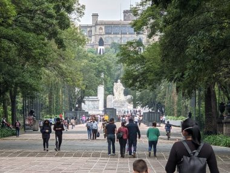
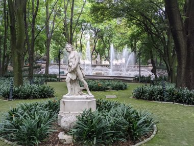
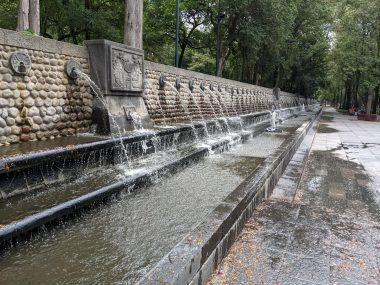
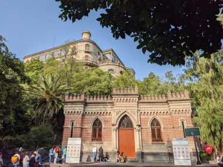
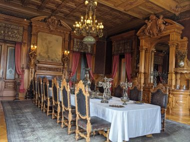
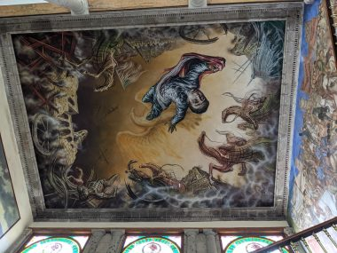
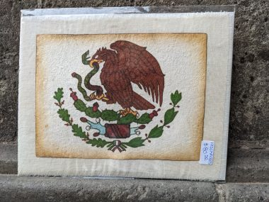
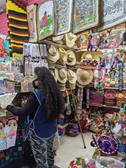
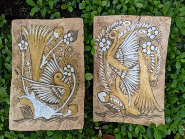

週末の朝はいつも食べる朝食の店が閉まっているので、土、日はバルバコアラムのタコスの屋台で朝食を食べた。

テーブルや椅子もセットされ、屋外で座って食べる。朝7時くらいから午後早い時間、２時ころまでやっていた。週末にはここで食べるのが楽しみだった。

かなりの時間をかけてゆっくりと蒸し焼きにされた子羊の肉は柔らかくジューシーで、この店はトルティーヤの上にたっぷりと肉を乗せてくれる。そのうえにサボテンの漬物をのせ、好みでトマトや玉ねぎ、コリアンダーの葉をトッピングして食べる。

肉を蒸したときにでるの汁で作られたスープもおいしいので、いつもセットで頼んだ。

<video width="1920" height="1080" controls><source src="../uploads/PXL_20210718_125237380.mp4" type="video/mp4"></source></video>

<!--more-->

&nbsp;

シェアサイクルの自転車を借りて自転車で観光スポットの旧市街へ。

旧市街へ着いたら、まずシアーズというデパートへ行く。トイレを借りられるのと、カフェの景色が見事。

<video width="1920" height="1080" controls><source src="../uploads/PXL_20210711_173507472.mp4" type="video/mp4"></source></video>

カフェで一息ついたら再び自転車を借りてソカロと呼ばれる広場へ。

<video width="1920" height="1080" controls><source src="../uploads/PXL_20210718_160909909.mp4" type="video/mp4"></source></video>

メキシコシティの観光は旧市街だけではなく、チャペルテックと呼ばれる公園も楽しかった。

よく整備だれた緑あふれる広大な森林公園で

いたるところにある噴水も見事。

美術館やお城もある。

お城の内部も見学できる。かつてはメキシコ皇帝が住み、後には大統領公邸として使われた。

メキシコでの戦争にまつわる絵画も豊富で歴史も学べる

↓靴を履いている人といない人で支配者とそうでないものが区別して描かれている。

↓アメリカに侵略され領土の半分を失うことになった戦争で、メキシコを守るためにこの城で戦い戦死した少年兵の絵。

↓お城の売店で買った絵。メキシコの国旗に描かれている。

買い物は、手工芸品の市場も楽しかった。

狭い通路にぎっしりと手工芸品の店が並ぶ。カラフルで観るだけでも楽しい。

↓たくさん買い物したくなってしまうが、持って帰れないので、リビングに飾る絵を買った。ハンドペインティングのポストカードサイズの絵。

 
<a href="https://overseas.blogmura.com/canada/ranking/in?p_cid=10145848" target="_blank" rel="noopener">にほんブログ村</a>

 
<a href="https://overseas.blogmura.com/toronto/ranking/in?p_cid=10145848" target="_blank" rel="noopener">にほんブログ村</a>

