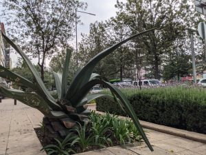
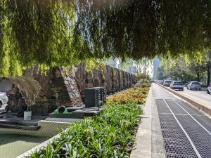
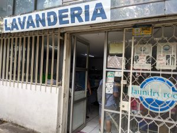
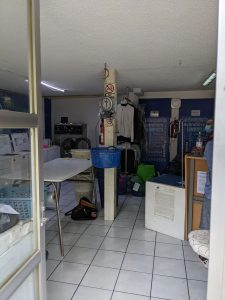
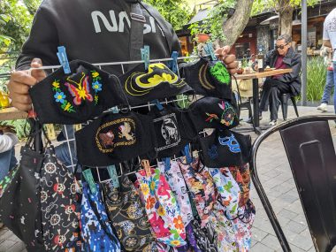
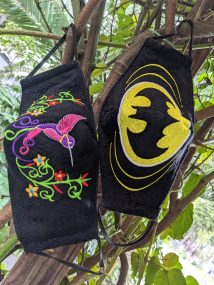
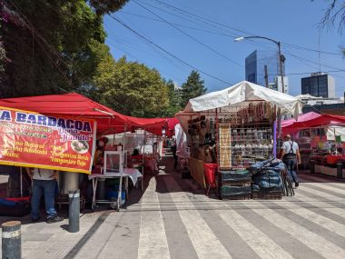
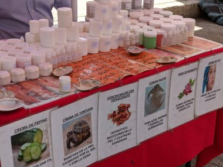
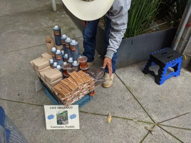

7月中旬のメキシコの朝、気温16度。晴れ。メキシコシティの朝は夏でも寒いので長袖シャツにパシュミナを羽織る。

朝食を済ませた後は、近所に見つけた洗濯屋へと歩いて向かう。

<!--more-->

道中は、巨大アロエのそばをとおり、

遺跡と思われる道を通ったりして、

Madellin x Puebla にあるメキシコでラバンドリアと呼ばれる洗濯屋へ着いた。

洗濯ものは入れておいた袋からだして、ぶら下がっている計量用の青いかごの中に入れると、お店の人が伝票を書いてくれて、お金を払う。

ここは重さ１ｋｇまでだったら27ペソで、洗濯、乾燥をしてくれる。

この日は計800グラム、１ｋｇ以内でおさまったので、27ペソ払って店をでる。日本円で２００円くらいか。

平日だったので、朝１０時近くになっていたけれど、同日夕方17時には乾いて畳まれたものを受け取ることができた。長期滞在にはつきものの洗濯の悩みを解消してくれてうれしい。

&nbsp;

その後Madellin通りを２ブロック南へ歩き、マドリッドにある有名な噴水のレプリカのある、Fuente de Cibelesを見に行く。ネットフリックスが制作し、賞をとったローマという映画の舞台となったローマ地区にある。中央に噴水を囲んだ丸い交差点を中心に放射線状に道が展開していく。

<video width="1920" height="1080" controls><source src="../uploads/PXL_20210714_152951089-1.mp4" type="video/mp4"></source></video>

うっそうと茂っている木の下のカフェの屋外の席でマリアッチが音楽を奏でるなかコーヒーを飲んで一息ついた。

J次郎は持ってきたPCを開いてノマドワーク開始。

マリアッチの他にも、手編みの麦わら帽子やら木のおもちゃやら、様々な者を売る行商がひっきりなしにきて退屈しない。テレビの通販番組さながらだ。ちなみに麦わら帽子が一番売れていた。

子供が売りにきたので買ってしまった。おばあちゃんが縫ったそう。ハチドリとバットマンのマスク。

ここら辺一帯はカフェやおいしいそうなパン屋など素敵な店が多く、散策してみたら、通りに市が開かれている道があり、ぶらぶらとのぞいてみた。

美容クリームを売っている露店があった。 
ずらりと並べられた写真のなかにはウミガメの写真が。ウミガメクリームと書いてある。

ウミガメのクリームってなんだろうとおもい聞いてみると、ウミガメを殺して絞り取ったわけではなく、孵化後のウミガメの卵の殻を使ったクリームでシミにきくそう。卵角膜美容液のウミガメ版といったところか。

５０ｇで１５０ペソ。結構高い。３つで３００ペソだけど、肌に合わなかったら無駄になるし、荷物を増やしたくなかったので、ひとつだけ買うことにした。

ホテルで提供されるロキシタンのボディークリームはアーモンド油ベースで、アーモンドに遅延性アレルギーがある私が使ったら、ぽつぽつとした湿疹ができてしまって困っていたのだ。

付け心地はさらっとしていてなかなか良い。

ウミガメといえば、中米生まれのJ次郎はかつて幼いころに食べたウミガメの卵の味が忘れられないそう。絶滅の危機となった今ではもう二度と味わうことができないが。

誤解されてカナダの入国検査で取り上げられると困るので、後日、クリームの容器に張られたウミガメと書かれたシールははがした。

そして野菜を売っている露店で小さめのパパイヤを買ってホテルに戻った。パパイヤは包丁がなくても、ステーキナイフで簡単に切れるので、ホテルの部屋で自分でカットして食べられるのだ。

↓ホテルへ戻る道でコーヒー豆やはちみつを売る人。産地から売りに来たらしい。

選べたのでダークローストの豆を買ってカナダへ持ち帰って味わった。

&nbsp;

なぜ私が道でものを買うかというと、なるべくなら地域経済に貢献できるような消費をしたいという思いがあるからだ。

地球規模で考えると、先進国で生まれ育った私は相当に恵まれている。私が今こうしてのうのうと暮らしていける一番の理由はただ単に生まれた場所が良かったというだけのことであったりする。

大した金額ではないのなら、ぼったくられたりだまされたとしてもそれはそれでいいと割り切っている。

私が幼かった昭和の頃、夕暮れ近くになると、自転車で売りに来る豆腐屋のならすぷーぷーと言う音で祖母が慌てて使い込まれたプラスチックの丸い器を持ってサンダルをつっかけて外に出て行ったのを覚えている。そんな時代を覚えている私にとって、生活感に溢れているメキシコシティの街は心地よく感じられるのだった。

 
<a href="https://overseas.blogmura.com/toronto/ranking/in?p_cid=10145848" target="_blank" rel="noopener">にほんブログ村</a>

 
<a href="https://overseas.blogmura.com/canada/ranking/in?p_cid=10145848" target="_blank" rel="noopener">にほんブログ村</a> 
&nbsp;

&nbsp;

