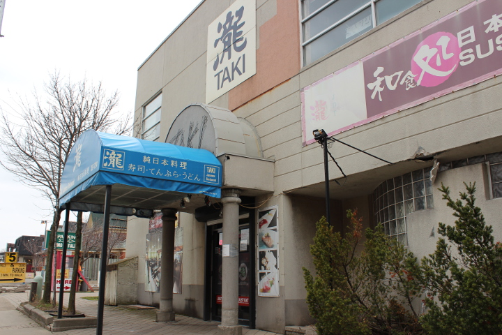
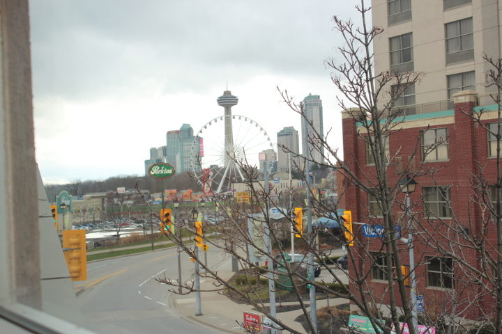
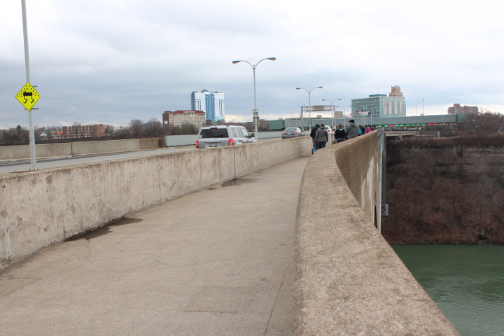
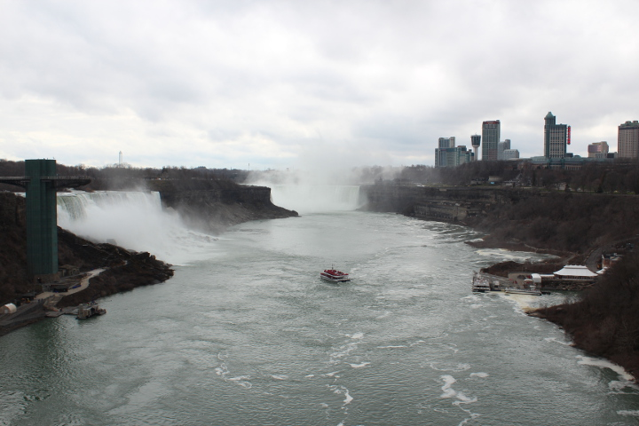
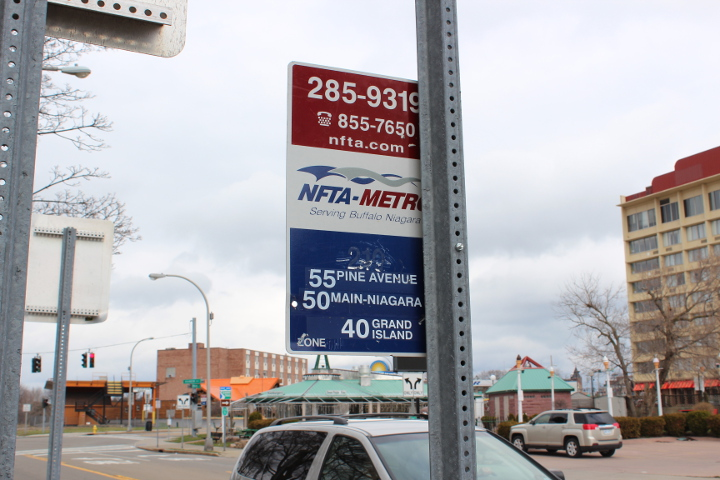
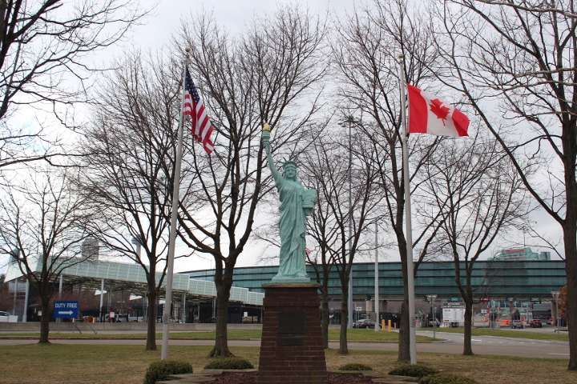
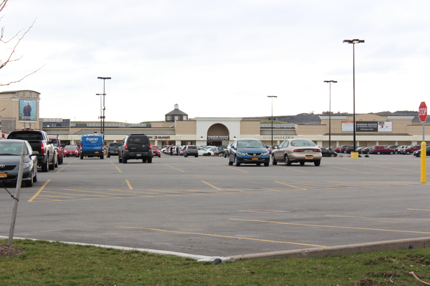

２０１６年４月１日。気温９度。風が強く、今にも雨が降りそうな曇り空。

まずはおなじみ<a href="http://safewaytours.net/casino-tours/">カジノバス</a>でトロントのダウンタウンからナイアガラへ。ホリデーインホテルの前からでる１０時４５分発のバスに乗る。料金はひとり８ドルに値上がりしていた。

１２時半、ナイアガラのFalls View Casino着。

<!--more-->

まずは腹ごしらえすべく、友達に教えて貰った和食の店へ徒歩で向かう。

１時半、<a href="http://www.niagaratakirestaurant.com/">Taki</a>に着く。斎藤カナダというカナダのお土産を売る店の２階にある。

↑　窓からの眺め。

ランチメニューの中から刺身定食をオーダー。ご飯と味噌汁、サラダがついて＄１５。

お腹を満足させた後は近くにあるレインボーブリッジへ向かう。

橋を渡るのにひとり５０セント払う。２５セント硬貨のみ使えるが、両替機があるので２５セント硬貨を持っていなくても大丈夫。

カナダををでていよいよアメリカへ徒歩で国境越え。

橋からの眺めは絶景。

アメリカ側に着いたらパスポートチェック。ここで６ドル払う。支払いはUSドルのみ。

橋を降りたらバスに乗るべくバス停へ。

ファッションアウトレット行きのバスのバス停は、レインボーブリッジを渡り終えてすぐ、Rainbow BlvdとNiagara Stの交差点、Rainbow Blvdの、DAYS　INNというホテル並びにあるPunjabi Hutというレストランの前、自由の女神像がある側にある。

観光地化した華やかな雰囲気のカナダサイドと違い、閑散としたうら寂しい雰囲気。決して治安がいいとはいえない地域。女子ひとりでは来たくない。

３時４８分、やっときた５０番、Niagara Falls Transit Center 行きのバスに乗る。５５番のバスでも着く。

バスはひとり２ドル。乗るときにファッションアウトレットに行くかどうかしっかり確認したおかげで、バスの運転手はおりるときにここで降りろ、と声をかえてくれた。帰りのバスについても、５５番のダウンタウン行きのバスでも帰れるからね、と親切に教えてくれた。所用時間約３０分。

４時２０分、ついに本日の目的地、ファッションアウトレットに到着。バスの本数が思ったより少なかったのと、US側に着いたとき、たまたま観光バスに乗った一団が同時に着いて入国審査待ちの時間が長かったので、ここまでで随分時間がたってしまった。美味しかったけど、レストランでのんびりご飯食べてる場合ではなかった。

さっそく向かった店はVitamin World。ここでサプリをまとめ買いする。カナダでは処方箋が必要だが、アメリカでは必要ないというお目当てのサプリがBOGO, Buy One Get One Free（一つ買うと一つ無料）だったうえ、まとめ買いに気を良くしたのかお店のお兄さんがカウンターの引き出しからクーポンをだしてくれて、さらに２５ドルオフにしてくれたのでかなりお得な買い物になった。メンバーになる年会費は無料とのこだったのでメンバーシップカードも作った。

スタバを見つけたのでハーブティーを買う。カナダドルが入ったスタバカードで問題なく支払えた。

そしてバス停へ向かう。結局アウトレットに滞在したのは３０分ほどだった。指定された帰りのカジノバスの時間に間に合わせたかったのと、カナダドルが安すぎてアウトレットとはいえ買い物をする気にもなれなかったのだ。

５時１分、５０番のバス乗る。帰りも所用時間３０分ほど。

再び歩いて橋を渡り国境を越え、フォールズビューカジノへ着いたのは６時を少し過ぎたころ。

６時半のバスに間にあったのでほっとした。バスは間に合わなかった場合は次の便に変更できるがちょっと面倒くさいことになるのだ。６時１０分にはトロントへ帰るバスが来て乗れた。

 
<a href="http://overseas.blogmura.com/toronto/">にほんブログ村</a>

 
<a href="http://overseas.blogmura.com/canada/">にほんブログ村</a>

