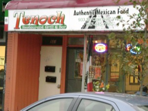
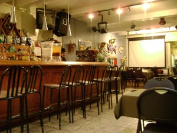
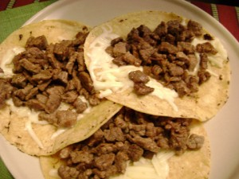
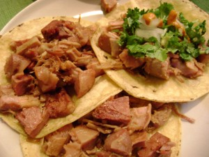
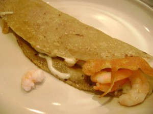

ある日のこと、J次郎は憤慨していた。同僚がおいしいと言っていた新しいブリトーの店に行ったところ、肉がパサパサしてて、全然おいしくなかったというのだ。その同僚を信用した俺がバカだったとまで言っていた。食べ物のこと、特にブリトーに関しては大真面目で、新しいブリトーの店ができると試してみたくて仕方がない様子。

さて、知り合いのメキシコ人は、素朴な温かみのあるすごーく良いひと。いつもニコニコしていて、ポジティブなオーラ全開で、一緒にいて気持ちいいのだ。

深い付き合いというわけではないのだが、ふとしたことから彼女の旦那さん一家がトロントでメキシコ料理の店を営んでいると教えてくれ、絶対行ってみようと決めていた。良いひとだからといって味が保証されるわけではないが、なんだかきっと良い店に違いない、と勘が働いたのだ。すくなくとも上記のJ次郎のブリトー事件のようなことは避けられるはずだ。

そして、私の勘は大当たり。

場所はダウンタウンからは離れているとはいえ、Oakwood＆St. Clair Westの交差点に位置し、ストリートカーを降りてすぐ。店の名前は<a href="http://tenochrestaurant.com/">TENOCH</a>。

店内は気取りの全くない、本当にカジュアルな雰囲気。ここは内装は二の次なのだ。店のなかではスペイン語しか聞こえない。英語で話している客は私たちだけ。

メニューを開いてJ次郎は感動していた。もともとラテンアメリカ系のJ次郎にとって、どれも馴染みのある、好物ばかり。全部頼んでみたいそう。

私たちは迷わずタコスをオーダー。タコスの皮はソフトタイプで、とろけたチーズの上に具がのっている。別添えでコリアンダーとたまねぎ、ライムがでてくるので、好みでのっけて食べる。他、ソースも２種類。グリーンのソースと赤い色のソース。赤いほうのソースはわたしには激辛だったのでグリーンのほうを少しのっけてたべた。

豚肉を控えているJ次郎は、Bistec con Queso（Steak&amp;cheese）＄８。細切れのステーキ肉がたっぷりとのっている。

私はCarnitas（Slow cooked pork）＄８にした。とろけるようにやわらかい豚肉がたっぷりとのっている。別に添えられたコリアンダーとタマネギを好みでのせ、ライムを絞る。豚肉がたくさんのりすぎてて食べるときにどうしてもはみだしてしまうのだった。

そして、ケサディヤは、Camarones con Queso（Cooked shrimp and cheese）＄５。エビとチーズが熱々。

帰り際知り合いとその旦那さんが店にあらわれ会話した。旦那さんは、ここではメキシコで食べられている料理をだしているんだ、と教えてくれた。

私たちが行ったのは土曜の午後４時近く、ランチとディナーの間くらいの時間だったので席にすぐ着けたけど、週末、金曜の夜や土日は満席だそう。とっても繁盛している様子が伺える。

J次郎も大変気に入って、ここには是非またきて、次はあれを食べよう、これを食べよう、さてそれではいつ来ようか、などと思いを巡らせながら帰った。

 
 
<a href="http://overseas.blogmura.com/toronto/">にほんブログ村</a>

 
<a href="http://overseas.blogmura.com/canada/">にほんブログ村</a>

