
先日、Ｊ次郎の会社のクリスマスパーティーに行ってきた。

帰りはタクシーチケットがもらえるが、行きは自腹。

我が家から会場へは車で１０分弱くらいの距離なので、タクシーを呼ぶことに。 
<!--more-->

タクシーといえば、便利な半面、心配なときも。

地元のひとではないとわかると、ぼったくられたり、回り道されたり。

今回使ったのは、そんな心配の一切いらない、安心して使えるタクシー会社、<a href="http://www.uber.com/invite/uberfutarigurashi">UBER</a>。

利用するときには、目的地を入力すると見積もりがでて、だいたいどれくらいの金額がかかるか事前に把握できる。

オーダーは携帯を使って簡単にでき、予約完了後５分以内にはコンドのエントランスに車が到着した。

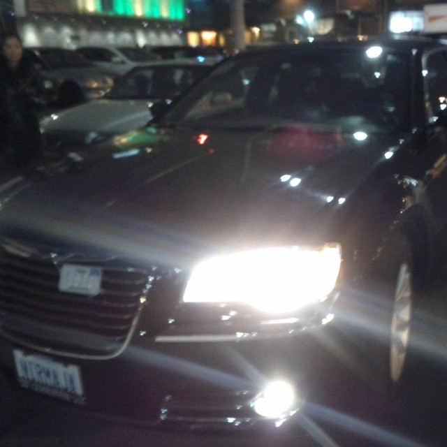

クレジットカードの清算なので、車内ではサインするだけで金銭授受がいらず、おつりの間違いや小銭を用意することもいらない。

支払った料金は見積もりどおりだった。

利用後はメールでレシートが送られてきて、乗った道順、距離もでるので納得の運賃。ドライバーの名前も顔写真つきでしっかり載っていて、車内に何か忘れたときでもすぐに連絡できる。

初めて利用したときは、画期的なシステムに感動。これ、実はドライバーにとっても利点はあるみたい。

ラグジュアリーカーサービスの会社なので、通常のタクシーより少しお値段は高くなるものの、安心して乗れるのでメリットは大きい。

↓↓↓ココから会員になると、初回１０ドルオフになります。追記：1月２０日までは初回２０ドルオフ↓↓↓ 
<a href="http://www.uber.com/invite/uberfutarigurashi">UBER(公式サイト）</a>

さて、着いたのはダウンタウンにあるクラブのガバメントに併設しているクールハウス。

クリスマスパーティー仕様に飾り付けられた会場。

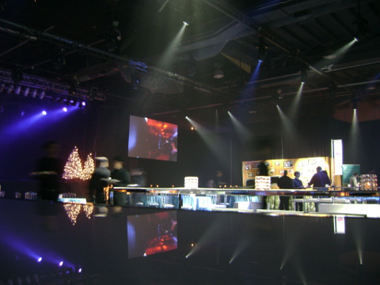

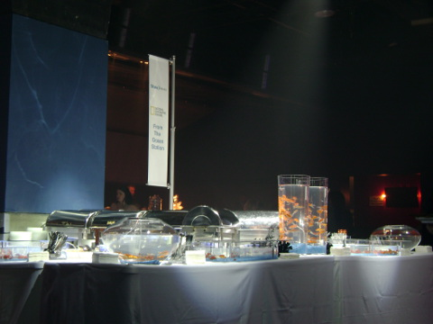

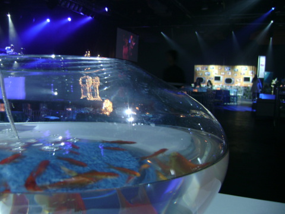

早めに着いたので早速会場内を探検。すると、動物を発見。

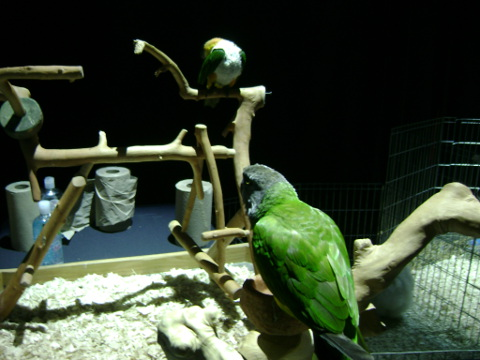

かわいいー。鳥好きの私にはたまらない。小学生のころこんなインコを飼っていたっけ。

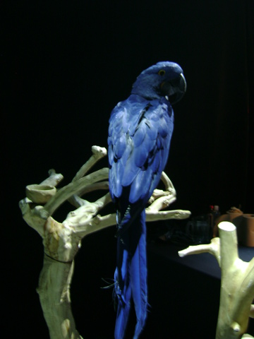

↓奥に見えるのはふくろう。

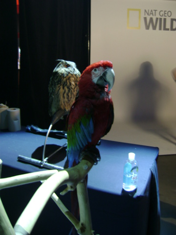

↓イグアナ

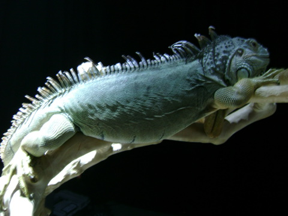

イグアナといえば忘れられない経験がある。メキシコのトゥールームというそれはそれはきれいなビーチでバナナを食べていたところ、体長１メートル近い野生のイグアナが急接近してきてかなりびっくりした。草食とはわかっていても間近に迫ってこられると怖い。そこで食べ終わったバナナの皮を投げてみたところ、なんとぺろりと丸吞み。そして他にもどこからともなくわらわらと群がってくる様子が感じられたのでやむなく退散したのだった。

↓　カンガルーの赤ちゃん。

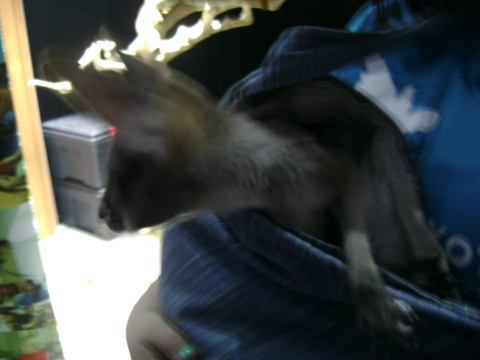

↓　そして、ライオンの赤ちゃん。とってもかわいい。触っても良いとのことだったので背中を撫でてみた。感動。硬い毛だった。

NATIONAL GEOGRAPHIC WILDの番組のプロモーションのために登場した動物たち。ブースで好きな動物と一緒に写真を撮れるのだけれど、終始長蛇の列。他にも蛇やらキツネザルやら珍しい小動物がたくさん。普段動物園の檻のなかでしかみれない動物に間近で見れて楽しい。イベントは大成功。

↓そして、アンカーたちのちょっとしたコントなども。

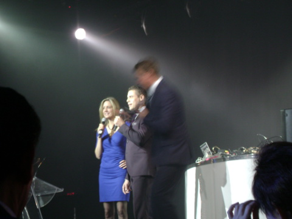

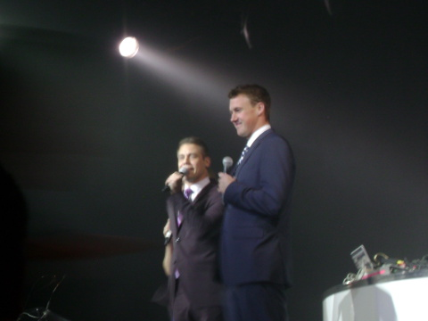

 
<a href="http://overseas.blogmura.com/toronto/">にほんブログ村</a>

 
<a href="http://overseas.blogmura.com/canada/">にほんブログ村</a>

