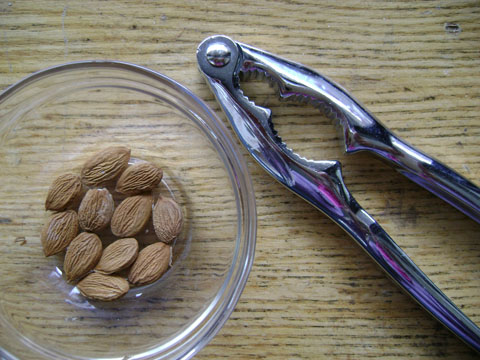

トロントは店先に様々なフルーツが並ぶ季節となった。毎朝朝食にはフルーツを食べているのでこの時期は選ぶのが楽しくなる。

先日はセールで、ワンパウンド（約４５４ｇ）あたり１．９９ドルになったアプリコットを買った。

日本では生の杏ってほとんど食べた記憶がないが安かったのでたっぷり買った。

そして、食べた後の種から杏仁豆腐を作れるのを何かで読んで、一度ためしてみたいとおもっていたのでさっそく挑戦してみた。

<!--more-->

種はしっかり乾いてからロブスターを食べるときに使う器具で割った。

すると中身はまるでアーモンド。ちなみにこれは食べるととても健康にいいらしい。

これを水にしばらく浸けると茶色の皮がつるっと向ける。

その後マジックブレットで水とよく撹拌し、漉すと、その白い液体はまさに杏仁豆腐の香り。

それを使って杏仁豆腐をつくるのだけれど、できた杏仁豆腐は自然な風味ですごくおいしかった。

手間がかかっても、市販品では味わえない味を味わえる、これぞ手作りの醍醐味だ。

＞＞＞<a href="magicbulletについて.html">マジックブレットについて説明した過去記事はこちら</a>。 

 

 

 

<a href="https://rpx.a8.net/svt/ejp?a8mat=1U7HZE+3WIBJM+2HOM+BWGDT&amp;rakuten=y&amp;a8ejpredirect=https%3A%2F%2Fhb.afl.rakuten.co.jp%2Fhgc%2Fg00ppmm4.2bo11f37.g00ppmm4.2bo12225%2Fa09082145081_1U7HZE_3WIBJM_2HOM_BWGDT%3Fpc%3Dhttps%253A%252F%252Fitem.rakuten.co.jp%252Fshopjapan%252Fmgtxh%252F%26m%3Dhttp%253A%252F%252Fm.rakuten.co.jp%252Fshopjapan%252Fi%252F10000104%252F" rel="nofollow">マジックブレット デラックス＜ブラック・パールピンク＞【ショップジャパン】【正規品】【ミキサー】【マジックブレッド】【マジブレ】マジックブレッド フードプロセッサー コンパクト 小型ミキサー</a>
 

価格:10,780円 
(2022/4/15 01:15時点) 
感想(817件)

 

 

 

 
<a href="http://overseas.blogmura.com/toronto/">にほんブログ村</a>

 
<a href="http://overseas.blogmura.com/canada/">にほんブログ村</a>

