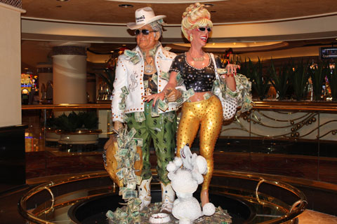
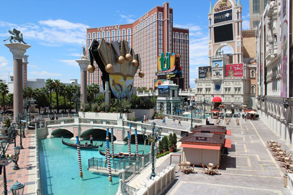
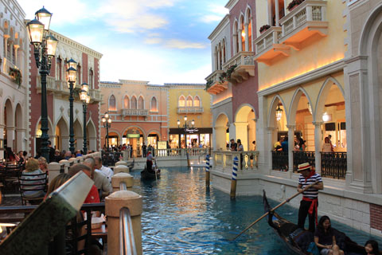
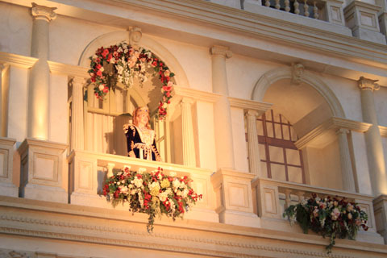
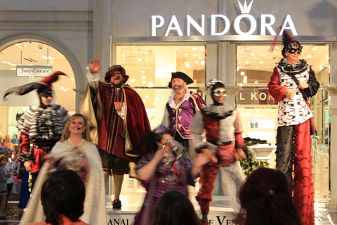
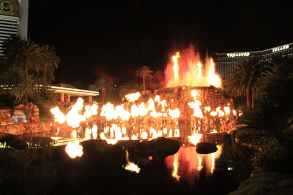
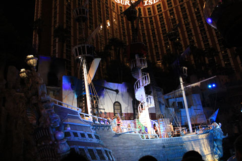

２０１２年８月６日（月）

RIOからシャトルバスでHARRAH'Sへ。さすがに月曜の午前中だとバスも空いている。

HARRAH'SのFLAVORSへブッフェをたべに来たのだ。１１時ちょっとすぎに着いたらすでに列ができていたものの、すぐに通される。

会計は前払いで、<a href="http://www.totalrewards.com/e-totalrewards/">TOTAL REWARDS</a>のカードを提示すると割引価格になり、さらにTOTAL VEGASの２for1のクーポンを使えたので二人で＄18.37。

ここはブラジル料理のシェラスコがある。J次郎は肉の塊に心が弾んでいたが、見た目よりは美味しくなかった様子。それでもふたりともおなか一杯になった後は、隣のVENETIANへ移動。

ゴンドラの船頭達は老若男女いて、彼らに共通しているのは歌がうまいということ。歌声がよく響く。

広場にでると、楽しげなショーをしていた。

その後はMIRAGEへ移動し、植物園を見てからトラムに乗りT.Iを経由してFASHON SHOW MALLへ。

巨大なモールだった。アメリカはカナダより服でも何でも値段が安く設定されていて、最近の為替の事情プラス消費税を考慮すると同じメーカーだったらアメリカで買うほうがずっと安い。夏物最終処分の時期でもあったのでトロントで買うかどうか迷っていた服が安く買えるかも、という淡い期待を抱いてFCUKに入ったら、セール品の値段設定が全然安くない。トロントで買うのとさほど変わらない。

J次郎の同僚が、ラスベガスは物の値段が高い、といっていたのを思い出した。そういえば、同じチェーンのドラッグストアもニューヨークやサンフランシスコではもっと安かった印象がある。

ここでのお目当てはGNC。ハワイでゴールドカード会員になっていたので２０％オフで買い物できた。買ったのはアトピー用にBIOTINの５０００mcg。なぜかトロントでは最高１０００mcgまでしかみつけられないでいたのだ。しかもアメリカで買ったようがずっと安い。

GNCの近くのアップルストア周辺ではネットに接続できた。いたるところに置かれているソファーで座ってメールチェック。この時点で相当歩いていたので疲れてしまって他の店を覗く気力もなく一旦ホテルへ戻る。

RIOに着いたのは５時過ぎていた。ここのプールは夕方になるとエリア全体が建物の陰になり、日焼けを気にせず過ごせ、暑さもだいぶ和らぐ。プールサイドでしばし休憩。

こうしてまたもやあっという間に夜になり、またストリップへ。

MIRAGEのショー、VOLCANOを観る。

炎が吹き出すと、暑い夜がさらに熱くなった。ショーはあっさり終わり、隣のTREASURE ISLANDへ。ここでもPLAYERS CARDを作る。ここでは最低でも１０ドル分のクレジットがもらえ、カジノでも使えるのだ。

１０時のショーを観るために外に出る。ここでも２０分も前なのにすでにすごい人。

ラスベガスらしく、セクシーな格好をしたお姉さんたちのパイレーツのショー。花火があっがたり無料とは思えない迫力。

ショーが終わるとJ次郎お待ちかね、さっそくカジノで遊ぶが、私が疲れきって眠くてたまらなくなってしまい早々に切り上げてもらった。ホテルへ着いたのは１２時を過ぎていた。

４日目へ続く。

 
<a href="http://overseas.blogmura.com/toronto/">にほんブログ村</a>

 
<a href="http://overseas.blogmura.com/canada/">にほんブログ村</a>

