
8月のある木曜日の夜、私とＪ次郎はST.JAMES PARKへ向かった。

↓公園入り口。この緑のアーチをくぐると、

<!--more-->

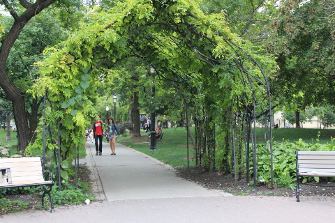

その先にはなにやら人だかりが。

この日は、野外ステージにてライブミュージックのイベントが開催される日なのだ。

&nbsp;

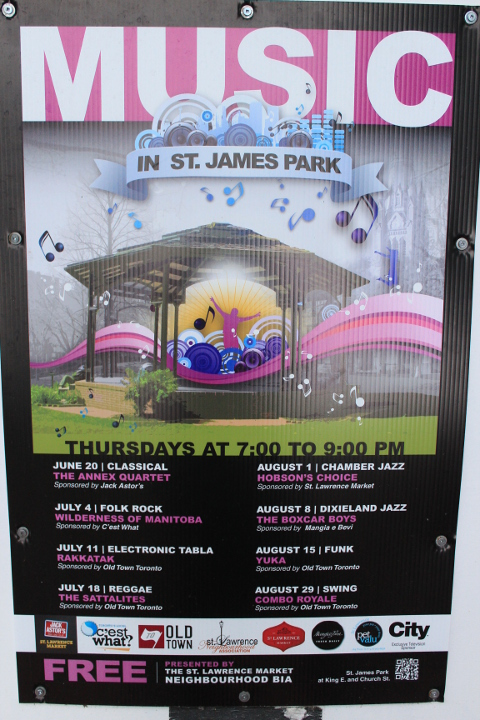

↓　THE BOXCAR BOYS

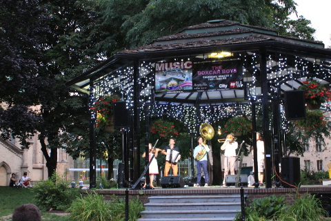

<iframe src="//www.youtube.com/embed/OoI7UBhhPqA?rel=0" height="360" width="480" allowfullscreen="" frameborder="0"></iframe>

このイベント、すごく雰囲気が良くて素敵だった。地元のひとが夕涼みに集まり、敷物を広げてピクニックしたり、音楽を聴きながら皆おもいおもいに夏の夜を楽しく過ごしていた。

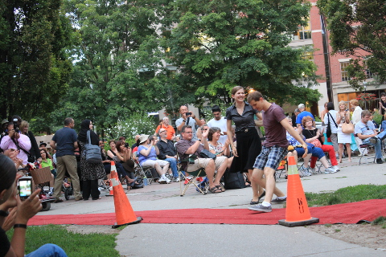

音楽にあわせて踊るひとたち。

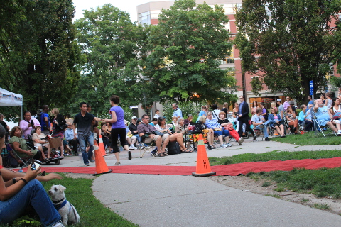

野外ステージの上を見上げると見えるのは教会の時計塔。

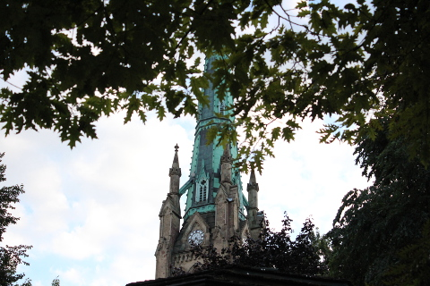

隣にそびえたつのはST.JAMES 教会。

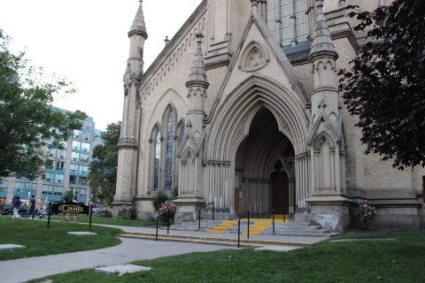

&nbsp;

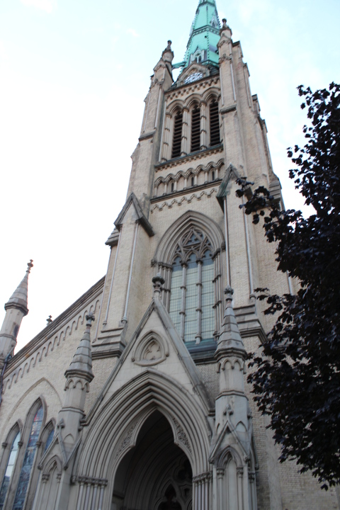

セントローレンスマーケットのすぐ近くにあるこの公園、ST.JAMES PARKはとても雰囲気の良い素敵な公園で、私とｊ次郎のお気に入りの公園でもある。

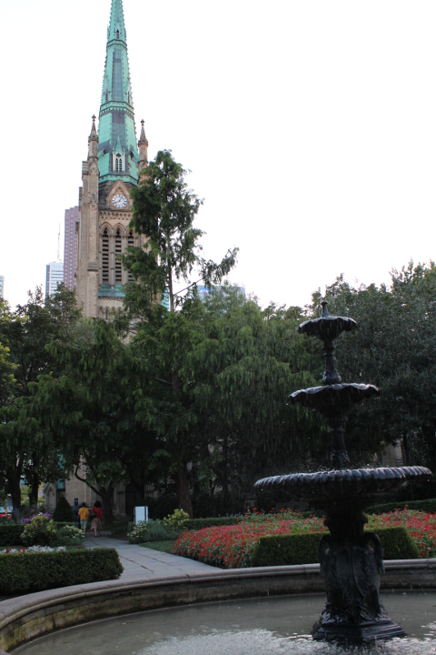

公園内は花も植えられ、きれいに整備されている。

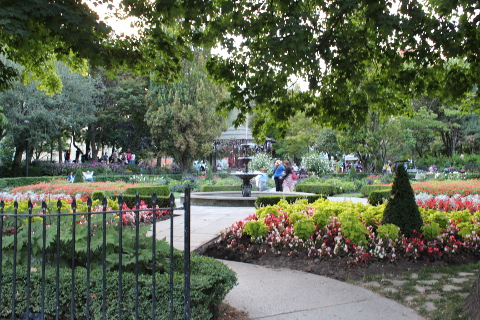

あまりにも楽しかったので次の週も行ってきた。

↓　YUKA

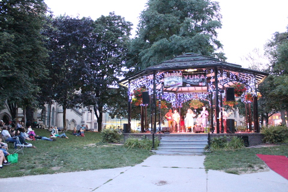

名前からしてもしかして日本人の女のひと？？とおもっていたが、そんなことはなかった。

<iframe width="480" height="360" src="//www.youtube.com/embed/Rl5aytmz6UE?rel=0" frameborder="0" allowfullscreen></iframe>

彼女の歌声は迫力満点。夜空に響き渡った。

 
<a href="http://overseas.blogmura.com/toronto/">にほんブログ村</a>

 
<a href="http://overseas.blogmura.com/canada/">にほんブログ村</a>

