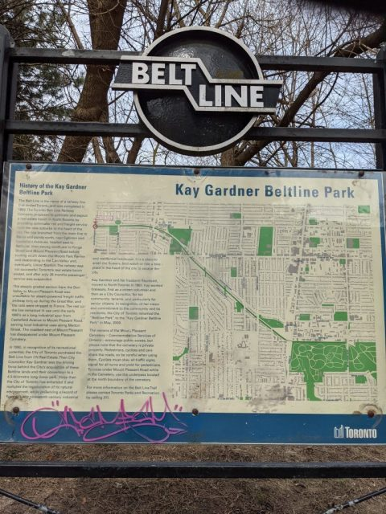
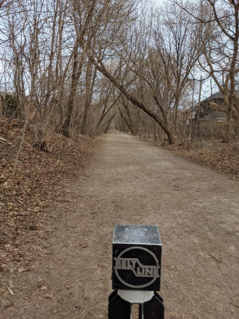
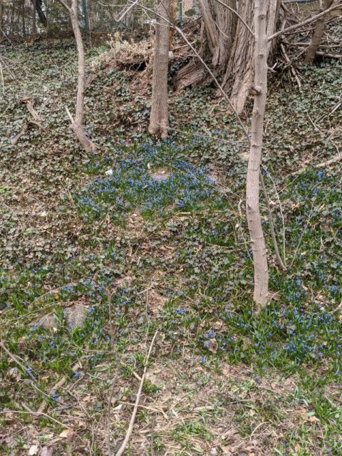
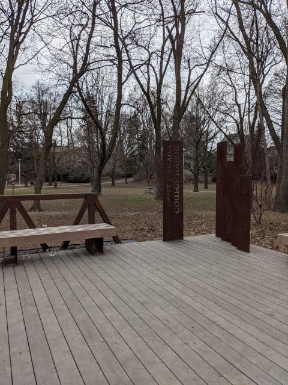
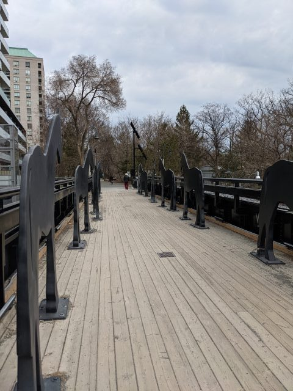
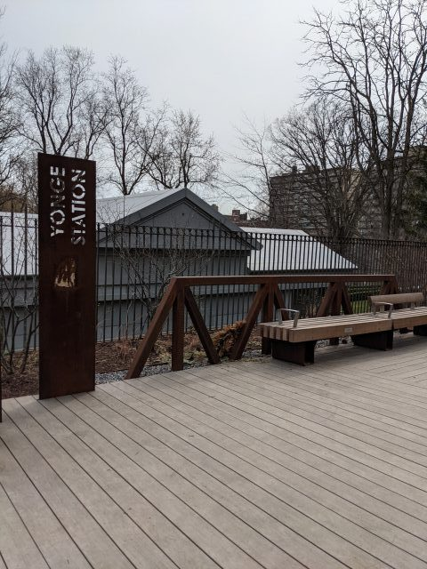
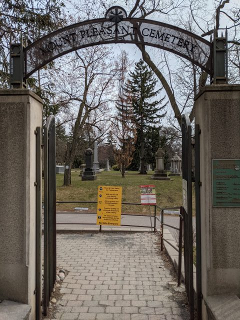
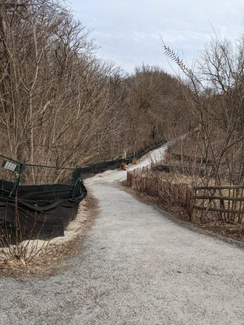

Toronto Beltline Trailはもともと通勤のための列車が走っていた道で、今は遊歩道になっている公園だ。

その一部である、Kay Gardiner Beltlineを歩いてみた。 

<!--more-->

Allen & Eglintonから始まりMt. Pleasant Cemeteryまで約２．５マイルの遊歩道が続く。 

↓Kay Gardiner Beltlineのスタート地点 

道の表面は舗装されていないがしっかり踏み固められていて平らなので歩きやすく、ジョギングしているひとも多い。 
この日は平日だったから人は少なく静か。あちらこちらから鳥のさえずりが聞こえる。

リスがまつぼっくりを食べるのに見入って足をとめた。

https://youtu.be/GLJc7dsDR7g

4月のトロントはまだまだ寒く、曇りで肌寒い日だったが、春の訪れも感じられる。

住宅街のなかに隠れるようにこんな素敵な遊歩道があったなんて。引っ越すならこの近くもいいね、などと思いながらてくてく歩く。

↓かつての駅があった場所。 

↓Yonge street を超える橋。Davisvill駅の近く。 スタート地点からここまで1時間。 

橋を渡り終えたところにはかつての駅があり、

Mountpleasant Cemetaryの入り口へ。Kay Gardiner Beltlineはここまで。

Mountpleasant Cemetaryを抜けて横断歩道をわたった先からはMoore Park Ravine へとBelt Lineは続いていく。

また違う季節にきて折々の自然の光景を楽しみにきたい。ビクトリアデーが過ぎれば、道すがら通り過ぎた公園に併設された公共のお手洗いも使えるようになるので、もっと長くいられる。そうしたらお弁当を持ってまた歩きにこよう。

 
<a href="http://overseas.blogmura.com/toronto/">にほんブログ村</a>

 
<a href="http://overseas.blogmura.com/canada/">にほんブログ村</a>

